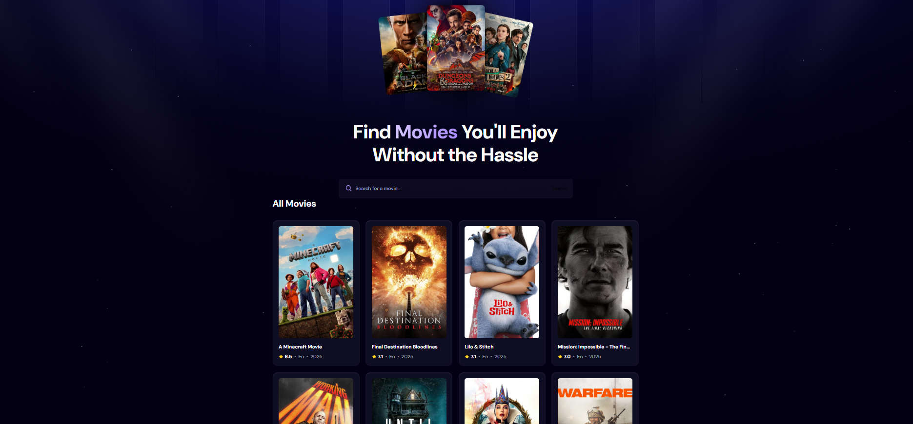

 
  
  

    
    
    
  

  <h3 align="center">A Movie Application</h3>

    

## 📋 <a name="table">Table of Contents</a>

1. 🤖 [Introduction](#introduction)
2. ⚙️ [Tech Stack](#tech-stack)
3. 🔋 [Features](#features)

## <a name="introduction">🤖 Introduction</a>

Built with React.js for the user interface, Appwrite for the Trending Movies Algorithm, and styled with TailwindCSS.

## <a name="tech-stack">⚙️ Tech Stack</a>

- React.js
- Appwrite
- Tailwind CSS

## <a name="features">🔋 Features</a>

👉 **Browse All Movies**: Explore a wide range of movies available on the platform.

👉 **Search Movies**: Easily search for specific movies using a search function.

👉 **Modern UI/UX**: A sleek and user-friendly interface designed for a great experience.

👉 **Responsiveness**: Fully responsive design that works seamlessly across devices.
